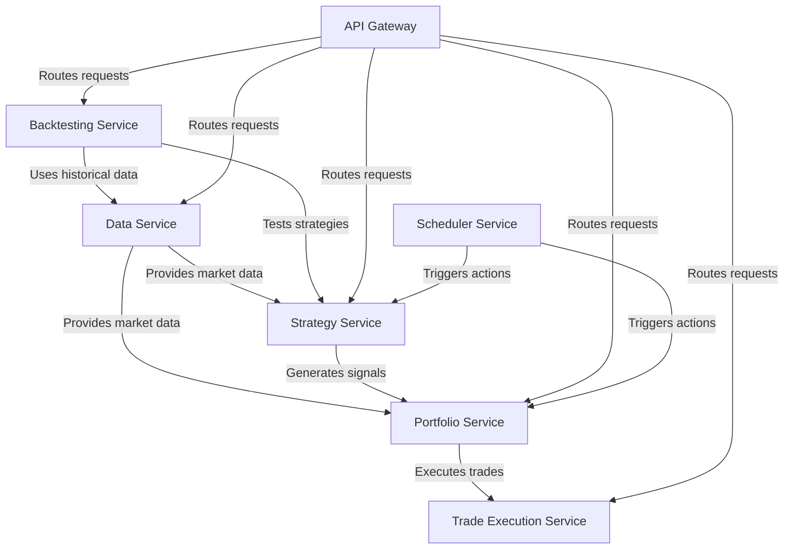

# Trading System

## Service Responsibilities

1. Data Service:
   - Aggregates and stores historical and real-time market data
   - Calculates and stores common indicators (e.g., moving averages, ATR)
   - Provides efficient data retrieval for other services
   - Handles data normalization and cleaning

2. Strategy Service:
   - Implements the momentum trading strategy logic
   - Calculates stock rankings based on volatility-adjusted momentum
   - Generates buy/sell signals based on strategy rules
   - Allows for easy modification and addition of new strategies

3. Portfolio Service:
   - Manages the current portfolio composition
   - Handles position sizing and risk management
   - Performs weekly portfolio rebalancing
   - Tracks performance and generates reports

4. Trade Execution Service:
   - Interfaces with various brokers and exchanges
   - Executes trades based on signals from the Portfolio Service
   - Handles order management and trade confirmation
   - Provides real-time trade status updates

5. Backtesting Service:
   - Simulates trading strategies on historical data
   - Generates performance reports and statistics

6. API Gateway (TBD):
   - Provides a unified entry point for external requests

7. Scheduler Service (TBD):
   - Manages the timing of various trading activities
   - Triggers weekly trading actions (every Wednesday)
   - Initiates bi-weekly position size rebalancing
   - Schedules regular data updates and system maintenance tasks

