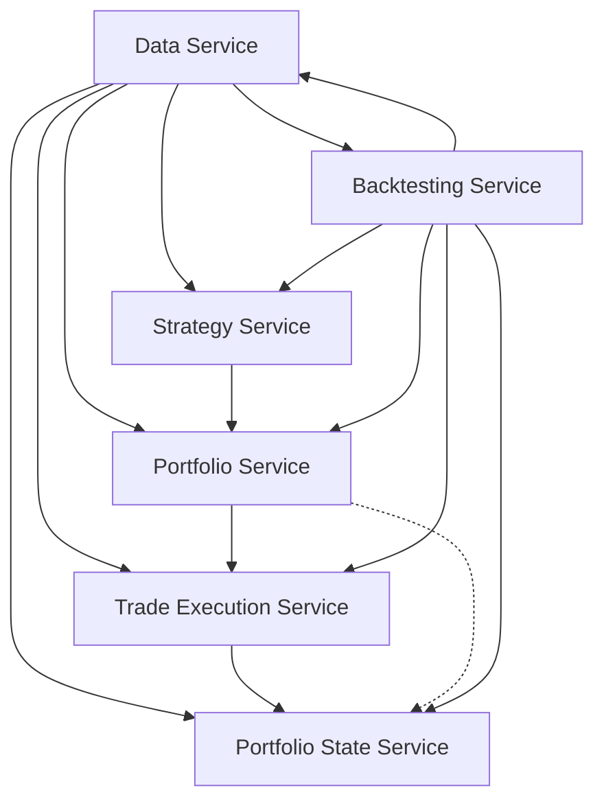

# Trading System

## Service Responsibilities

1. Data Service:
   - Fetch and store historical and real-time market data
   - Provide data to other services via API
   - Calculate and store common technical indicators
   - Manage data caching for improved performance

2. Strategy Service:
   - Implement and manage multiple trading strategies
   - Generate trading signals based on market data and configured strategies
   - Provide risk calculations for potential trades
   - Allow dynamic configuration of strategy parameters

3. Portfolio Service:
   - Receive signals from the Strategy Service
   - Determine desired portfolio state based on signals and current market conditions
   - Implement rebalancing logic and scheduling
   - Generate trade orders to align actual portfolio with desired state
   - Implement portfolio-level risk management rules
   - Manage cash allocations within the portfolio
   - Provide APIs for querying desired portfolio state and manually triggering rebalances

4. Trade Execution Service:
   - Receive and execute trade orders from the Portfolio Service
   - Interact with broker APIs or simulate trades in backtest mode
   - Track status of submitted orders (pending, filled, partially filled, cancelled)
   - Provide real-time updates on order status
   - Implement smart order routing and execution algorithms
   - Handle order types relevant to the trading strategies (e.g., market, limit, stop orders)

5. Portfolio State Service:
   - Maintain the actual, settled portfolio state
   - Reconcile desired state (from Portfolio Service) with executed trades (from Trade Execution Service)
   - Track actual positions, cash balance, and transaction history
   - Calculate and store portfolio performance metrics
   - Handle corporate actions (e.g., dividends, splits)
   - Provide APIs for querying current portfolio state and historical performance

6. Backtesting Service:
   - Coordinate with other services to simulate historical trading
   - Fetch historical data from Data Service
   - Generate historical signals using Strategy Service
   - Simulate portfolio management using Portfolio Service
   - Simulate trade execution using Trade Execution Service in backtest mode
   - Track simulated portfolio state using Portfolio State Service
   - Calculate and report backtesting performance metrics
   - Provide tools for strategy optimization and parameter tunin  g



## Example gRPC calls

1. Data Service (assumed to be running on port 50051)

   a. Get Stock Data:

   ```sh
   grpcurl -plaintext -d '{"symbol": "AAPL", "start_date": "2023-01-01", "end_date": "2023-06-01", "interval": "1d"}' localhost:50051 dataservice.DataService/GetStockData
   ```

   b. Get Batch Stock Data:

   ```sh
   grpcurl -plaintext -d '{"symbols": ["AAPL", "GOOGL"], "start_date": "2023-01-01", "end_date": "2023-06-01", "interval": "1d"}' localhost:50051 dataservice.DataService/GetBatchStockData
   ```

2. Strategy Service (assumed to be running on port 50052)

   Generate Signals:

   ```sh
   grpcurl -plaintext -d '{"symbols": ["AAPL", "GOOGL", "MSFT", "AMZN", "TSLA", "NVDA", "NFLX", "PYPL", "ADBE", "INTC", "CSCO", "CMCSA", "PEP", "AVGO", "TXN", "COST", "QCOM", "TMUS", "AMGN", "SBUX", "INTU", "AMD", "ISRG", "GILD", "MDLZ", "BKNG", "MU", "ADP", "REGN", "ATVI"], "start_date": "2023-01-01", "end_date": "2023-06-01", "interval": "1d", "market_index": "^GSPC"}' localhost:50052 strategyservice.StrategyService/GenerateSignals
   ```

   Configure Strategy:

   ```sh
   grpcurl -plaintext -d '{"strategy_name": "momentum", "parameters": {"lookbackPeriod": "90", "topPercentage": "0.2", "riskFactor": "0.001"}}' localhost:50052 strategyservice.StrategyService/ConfigureStrategy
   ```

   Get Strategy Parameters:

   ```sh
   grpcurl -plaintext -d '{"strategy_name": "momentum"}' localhost:50052 strategyservice.StrategyService/GetStrategyParameters
   ```

3. Portfolio State Service

   Get Portfolio State:

   ```sh
   grpcurl -plaintext localhost:50053 portfoliostateservice.PortfolioStateService/GetPortfolioState
   ```

   Update Portfolio State:

   ```sh
   grpcurl -plaintext -d '{"positions": [{"symbol": "AAPL", "quantity": 100, "current_price": 150.0, "market_value": 15000.0}], "cash_balance": 85000.0}' localhost:50053 portfoliostateservice.PortfolioStateService/UpdatePortfolioState
   ```

4. Portfolio Service

   Generate Orders:

   ```sh
   grpcurl -plaintext -d '{"signals": [{"symbol": "AAPL", "signal": "BUY", "risk_unit": 0.1, "momentum_score": 0.5, "current_price": 150.0}]}' localhost:50054 portfolioservice.PortfolioService/GenerateOrders
   ```

   Get Desired Portfolio State:

   ```sh
   grpcurl -plaintext localhost:50054 portfolioservice.PortfolioService/GetDesiredPortfolioState
   ```

   Trigger Rebalance:

   ```sh
   grpcurl -plaintext localhost:50054 portfolioservice.PortfolioService/TriggerRebalance
   ```

   Update Rebalance Schedule:

   ```sh
   grpcurl -plaintext -d '{"schedule": "weekly"}' localhost:50054 portfolioservice.PortfolioService/UpdateRebalanceSchedule

   ```

## Trading Process Summary

1. Every Wednesday: Update Portfolio
   - Check S&P 500 relative to its 200MA
   - For existing positions:
     - Sell if:
       - No longer in top 20% of momentum-ranked stocks
       - Fallen below its 100MA
       - Received an explicit sell signal
     - Adjust size if:
       - Still in top 20% and above 100MA, but target position size has changed
   - For new positions:
     - Only open if S&P 500 is above its 200MA
     - Buy stocks from the top 20% that aren't already in the portfolio

2. Every Second Wednesday of the Month: Rebalance Portfolio
   - Perform all actions from the weekly update
   - Additionally:
     - Rebalance all existing positions to their target sizes based on current risk factors
     - This rebalancing occurs regardless of the S&P 500's position relative to its 200MA
