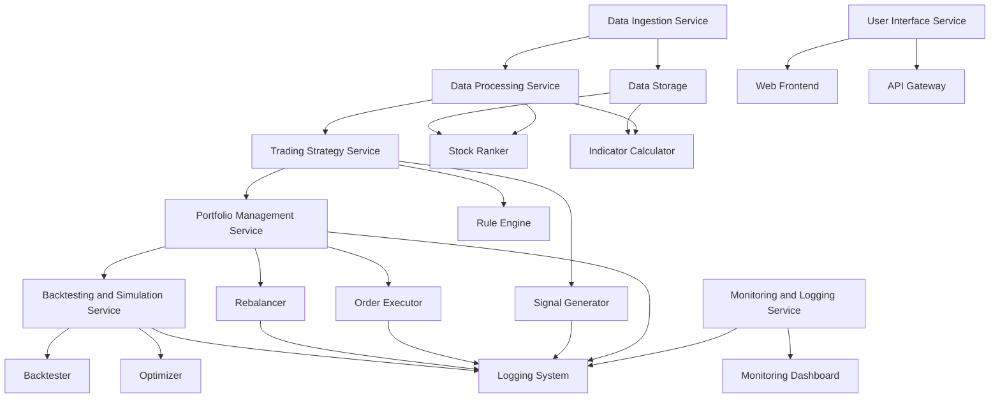

```mermaid
graph TD
    A[Data Ingestion Service] --> B[Data Storage]
    A --> C[Data Processing Service]
    C --> D[Trading Strategy Service]
    D --> E[Portfolio Management Service]
    E --> F[Order Executor]
    E --> G[Rebalancer]
    D --> H[Signal Generator]
    C --> I[Stock Ranker]
    C --> J[Indicator Calculator]
    D --> K[Rule Engine]
    B --> J
    B --> I
    E --> L[Backtesting and Simulation Service]
    L --> M[Backtester]
    L --> N[Optimizer]
    O[Monitoring and Logging Service] --> P[Monitoring Dashboard]
    O --> Q[Logging System]
    R[User Interface Service] --> S[Web Frontend]
    R --> T[API Gateway]
    E --> Q
    H --> Q
    F --> Q
    G --> Q
    L --> Q

```
