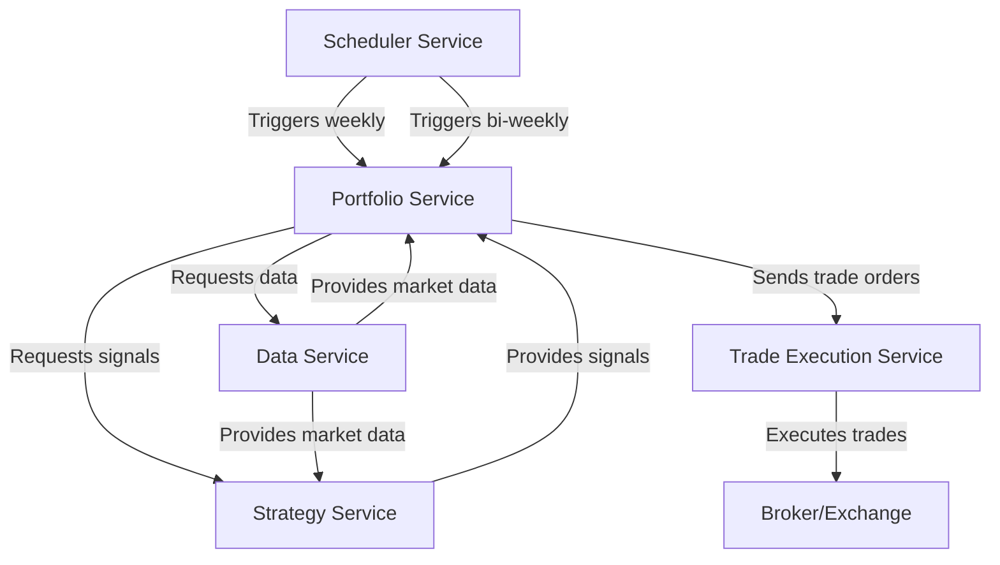

# Trading System

## Service Responsibilities

1. ✅ Data Service:

   - Fetch historical stock data from external sources (e.g., Yahoo Finance API)
   - Provide both single stock and batch stock data retrieval
   - Return OHLC (Open, High, Low, Close) price data, adjusted close prices, and volume
   - Handle date range and interval specifications in requests
   - Implement rate limiting to respect external API usage policies
   - TODO: Implement caching to reduce repeated API calls

2. ✅ Momentum Strategy Service:

   - Calculate momentum scores using exponential regression and R-squared for 90-day periods
   - Generate buy/hold signals based on momentum and price relative to 100-day moving average
   - Calculate ATR (Average True Range) for position sizing
   - Implement 15% gap check for the past 90 days
   - Rank stocks based on momentum scores
   - Filter to keep only the top 20% of stocks
   - Calculate position sizes based on ATR for risk parity
   - Provide a batch processing capability for multiple stocks
   - Sort and return signals for the top-ranked stocks
   - Logging of strategy calculations and decisions

3. TODO: Portfolio Service:
   - Manages the current portfolio composition
   - Handles position sizing and risk management
   - Performs weekly portfolio rebalancing
   - Tracks performance and generates reports

4. TODO: Trade Execution Service:
   - Interfaces with various brokers and exchanges
   - Executes trades based on signals from the Portfolio Service
   - Handles order management and trade confirmation
   - Provides real-time trade status updates

5. TODO: Backtesting Service:
   - Simulates trading strategies on historical data
   - Generates performance reports and statistics

6. TODO: API Gateway:
   - Provides a unified entry point for external requests

7. TODO: Scheduler Service:
   - Manages the timing of various trading activities
   - Triggers weekly trading actions (every Wednesday)
   - Initiates bi-weekly position size rebalancing
   - Schedules regular data updates and system maintenance tasks

