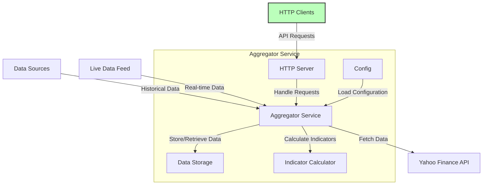

# trading_platform

## Aggregator Service

The Aggregator Service is a core component of the trading platform, responsible for aggregating historical and live data from various sources, calculating indicators, and serving this data through a set of HTTP endpoints.

### Overview

This service fetches historical data, updates live data, and calculates trading indicators. It interacts with external data sources like Yahoo Finance API and stores the aggregated data for further retrieval and analysis.



### Getting Started

#### Building the Service

To build the Aggregator Service, navigate to the service's root directory and run:

```sh
docker-compose up
```

OR

##### Aggregator

```bash
docker build -t aggregator -f aggregator/Dockerfile .
docker run -p 8080:8080 aggregator
```

##### Strategy

```bash
docker build -t strategy -f strategy/Dockerfile . 
docker run -p 8081:8081 strategy
```

#### Example Requests

- Aggregate & Loading the historical data to local protobuf file:

```bash
curl -X POST http://localhost:8080/aggregate_historical_data -d '{
  "symbol": "AAPL",
  "filename": "historical_data.pb",
  "start_date": "2000-01-01",
  "end_date": "2024-06-30"
}' -H "Content-Type: application/json"
```

- Getting the historical data from local protobuf file:

```bash
curl -X POST http://localhost:8080/get_historical_data -d '{      
  "symbol": "AAPL",
  "filename": "historical_data.pb",
  "start_date": "2024-01-01",
  "end_date": "2024-01-31"
}' -H "Content-Type: application/json"
```

## Strategy Service

wip...

## Platform Service

wip...

## Backtesting Service

wip...

## Trading Service

wip...
