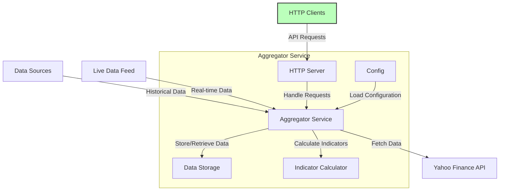

# trading_platform

## Aggregator Service

The Aggregator Service is a core component of the trading platform, responsible for aggregating historical and live data from various sources, calculating indicators, and serving this data through a set of HTTP endpoints.

### Overview

This service fetches historical data, updates live data, and calculates trading indicators. It interacts with external data sources like Yahoo Finance API and stores the aggregated data for further retrieval and analysis.



### Getting Started

#### Building the Service

To build the Aggregator Service, navigate to the service's root directory and run:

```sh
docker-compose up
```
## Strategy Service
wip...
## Platform Service
wip...
## Backtesting Service
wip...
## Trading Service
wip...